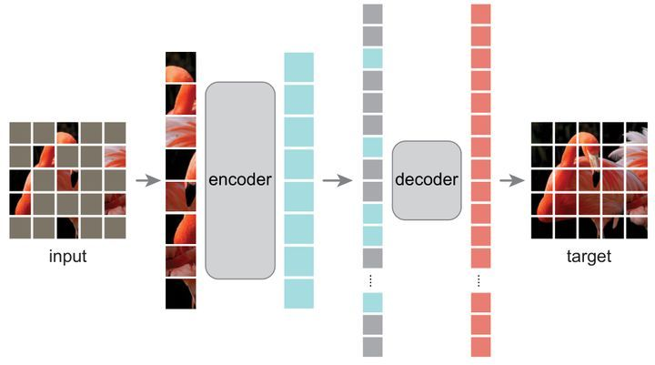
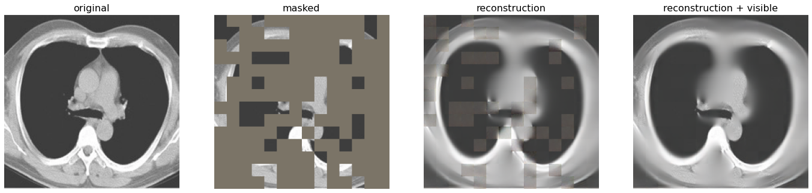

# MAE SSL for COVID-CT-SCANS
##  1. Experiment introduction

Masked Autoencoders (MAE) for self-supervised learning [(paper)](https://arxiv.org/abs/2111.06377). It belongs to the type of Generative (Predictive) pre-training.

Inspired by this method, a large amount of unlabeled data can be used to pre-train MAE model, and then fine-tune the model on the medical dataset COVID-CT.

### MAE MODEL

- 

  ### For CT-SCANS

  

## 2 Result

